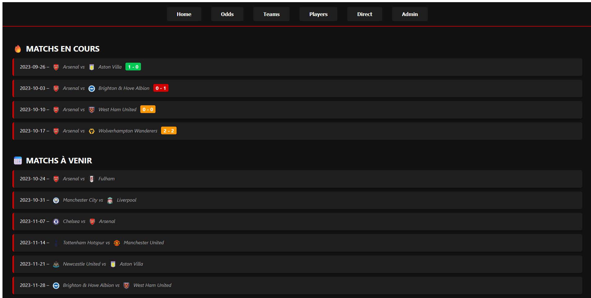
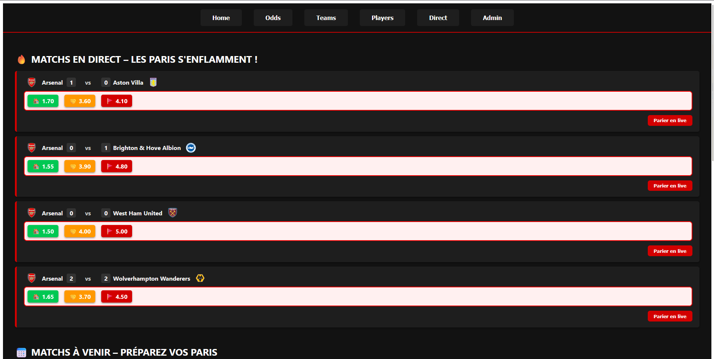

# Footbal Match Director

Un projet pour gérer des joueurs et des matchs de football.

Tout utilisateur pourra voir les matchs en cours, avec actualisation en live, les anciens matchs, les joueurs ainsi que leurs joueurs respectifs.
Il pourra aussi parier sur des matchs.

Un admin pourra lancer ou arrêter un match, ainsi qu'ajouter des buts.

## Aperçu visuel
Voici un aperçu de l'interface :

| Home | Bets |
|------|------|
|  |  |

[Démo](https://youtu.be/J1AIO0X46Bk)

## Fonctionnalités clés

- Gestion des matchs, joueurs et équipe
- Système de paris sportifs (avec cotes dynamiques)
- Authentification JWT avec rôles (admin / user)
- Notifications en temps réel (WebSocket / Redis)
(cache redis et swagger auto-générée)

## Prérequis

Pour lancer le projet, vous devez avoir installé :

- Node.js dans sa version LTS (≥ 22.15.0 et < 23.X.X)
- Docker
- Yarn

## Installation et lancement

Cloner le dépôt ou télécharger les fichiers.

1. Se placer dans le projet
```bash
cd football-match-director
```

2. Créer le fichier `.env`
  
Linux / Mac / Git Bash : `echo "JWT_SECRET=super-secret-key" > BACK/.env`  
Powershell : `"JWT_SECRET=super-secret-key" | Out-File -Encoding utf8 BACK/.env`  

3. Installation des dépendances et démarrage
```bash
yarn install && yarn start:all
```
(lancer Docker, puis démarraer le back et le front)

## C'est parti !
Se rendre sur http://localhost:5173/

Le backend sera disponible sur: http://localhost:8080
Et le swagger sur : http://localhost:8080/api-docs


## Utilisateurs de test

| Identifiant | Mot de passe | Rôle  |
|-------------|--------------|-------|
| `admin`     | `admin`      | admin |
| `user`      | `user`       | user  |

Utilisez ces identifiants dans `/login`.

## Commandes Utiles

Les tests se lancent avec
```bash
npm test
```

Pour réinitialiser les conteneurs et les données de la base mysql et de redis :
```bash
yarn reset
```

## Configuration

La base de données MySQL est configurée dans le docker compose avec les informations suivantes :

- **Base de données** : `winamax`
- **Utilisateur** : `root`
- **Mot de passe** : `Root@1234`

Redis est configurée dans le docker compose avec les informations suivantes :

- **Host** : `127.0.0.1`
- **Port** : `6379`

## Interface Frontend (Angular)

Le projet frontend est situé dans le dossier `FRONT/`. Il est développé avec **Angular**.

- **`/login`** : Page de connexion permettant à l'utilisateur de s'authentifier (JWT).

- **`/teams`** : Liste de toutes les équipes disponibles.

- **`/teams/:id`** : Affiche les **matchs à venir et terminés** pour l’équipe avec l’identifiant `id`, ainsi que la **liste des joueurs** appartenant à cette équipe.

- **`/players`** : Liste de tous les joueurs avec une **barre de recherche** pour filtrer par nom.

- **`/players/:id`** : Détail d’un joueur : nom, position, équipe, statistiques, etc.

- **`/home`** : Affiche la liste des matchs à venir et terminés (tous clubs confondus).

- **`/match/direct`** : Permet de sélectionner un match disponible pour le suivi en direct.

- **`/match/direct/:id`** : Page de suivi **en temps réel** du match avec identifiant `id` (mise à jour via WebSocket).

- **`/odds`** : Affiche la liste des paris disponibles, et permet à l'utilisateur un match sur lequel parier

- **`/bets/:id`** : Permet de parier un montant voulu sur l'issue du match sélectionné

- **`/bets`** : Permet de visualiser tous ses paris et son portefeuille actuel

- **`/admin`** : Interface permettant à un administrateur de **publier des événements clés (comme un but)** dans un match spécifique, en temps réel.
